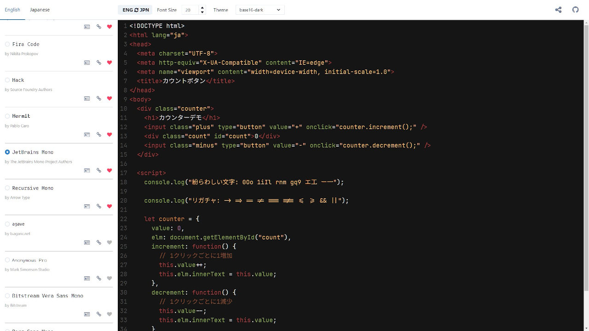

# Programming Font Combination

自分に合ったプログラミングフォントを見つける Web アプリ。  
[https://ippee.github.io/programming_font_combination/](https://ippee.github.io/programming_font_combination/)

アプリ紹介記事: [https://ippee-music.com/tech/programming_font_combination_app/](https://ippee-music.com/tech/programming_font_combination_app/)  
技術解説記事: [https://ippee-music.com/tech/programming_font_combination_tech/](https://ippee-music.com/tech/programming_font_combination_tech/)

## 使用技術

### 概要

- JavaScript
  - React
  - TypeScript
- CSS
  - Chakra UI
  - レスポンシブ対応
- Linter/Formatter
  - ESLint
  - Prettier
- Testing tools
  - Jest
  - React Testing Library
- その他
  - Hosting service
    - GitHub Pages
  - CI/CD
    - GitHub Actions
      - master ブランチへ変更が加わった際、GitHub Pages へ自動デプロイ

## アプリ詳細

プログラミングフォントを選ぶ上で、文字の可読性・識別性・判読性はもちろん、個人的な読みやすさというのも重要な項目です。

なのですが、プログラミング向けの和文フォントはあまり多く存在しません。  
そのため、中には英文フォントと組み合わせて使用する人もいるのですが、その組み合わせを見つけるために「フォントを探し、インストールしては組み合わせ、ダメだったらアンインストール……」という面倒な作業を何回も繰り返さなければいけません。

こうした手間を省くために、**Programming Font Combination** ではブラウザ上でプログラミング向け欧文+和文フォントを組み合わせ、自分に合ったフォントを簡単に探すことができます。

### 使い方

- **English**
  - 欧文フォントの一覧を表示する
- **Japanese**
  - 和文フォントの一覧を表示する
- **ENG ⇔ JPN**
  - フォントの読み込む順番を変更する（デフォルト：欧文 → 和文）
- **Font Size**
  - フォントサイズを変更する
- **Theme**
  - エディターのテーマを変更する
- **License**
  - フォントのライセンスを表示する
- **Link**
  - フォントのホームページへ遷移する
- **Favorite!**
  - お気に入りのフォントをリスト上部に固定する

### 個人的にオススメの組み合わせ

#### Ricty Diminished

私が前に使っていたフォントです。  
自分に合ったフォントが既に存在するのであれば、わざわざフォントを組み合わせる必要はありません。  
重要なことは、**自分が快適にコーディングできる環境を整えること** です。

#### Courier Prime Code + Ricty Diminished

私の現在の組み合わせです。  
そのまま組み合わせると「全角：半角＝３：５」という白源 Like な比率になります。  
やや特殊な比率ではありますが、半角文字がぎゅうぎゅう詰めにならず余裕があるためとても読みやすいです。

#### JetBrains Mono + Nasu

こちらも「全角：半角＝３：５」の比率になります。  
JetBrains Mono は書体がハッキリとしておりとても読みやすいのですが、そんなことよりリガチャを使えるのがとても楽しいです。

#### Victor Mono + MyricaM

Victor Mono もリガチャ対応のフォントです。  
こちらはスッキリとした書体が特徴で、エディターの見栄えがゴツくなりにくいです。  
和文フォントと合わせるときはウェイトが軽めなものを選択してあげるとハマりそうです。  
ただし、「全角：半角＝６：１１」という奇妙な比率になります。

### ここにはないオススメのフォント

有料であったり、ライセンスの理由でアプリに搭載できなかったフォントをいくつかご紹介いたします。

#### 欧文フォント

- Cartograh
  - [https://connary.com/cartograph.html](https://connary.com/cartograph.html)
  - 有料フォント
- Ellograph
  - [https://connary.com/ellograph.html](https://connary.com/ellograph.html)
  - 有料フォント
- Envy Code R
  - [https://damieng.com/blog/2008/05/26/envy-code-r-preview-7-coding-font-released](https://damieng.com/blog/2008/05/26/envy-code-r-preview-7-coding-font-released)
  - 利用規約により、リポジトリにフォントをアップできない
- input
  - [https://input.djr.com/](https://input.djr.com/)
  - 個人利用は無料
- Overpass
  - [http://overpassfont.org/](http://overpassfont.org/)
  - OFL と LGPL のデュアルライセンス

#### 和文フォント

- Migu
  - [https://mix-mplus-ipa.osdn.jp/migu/](https://mix-mplus-ipa.osdn.jp/migu/)
  - IPA 系フォント

### 備考

#### フォントのサブセット化＆圧縮

Programming Font Combination では、容量削減のため和文フォントを以下の内容でサブセット化をしています。  
[https://gist.github.com/ippee/2253e31a4ff9a3b40c9ea558ebd82441](https://gist.github.com/ippee/2253e31a4ff9a3b40c9ea558ebd82441)

また、全フォントを.woff2 形式に圧縮しています。

## 今後の課題

例えば VSCode のように、複数のフォントを選択できるエディターであれば問題ないのですが、それ以外のエディターや iTerm 等のターミナルでは、フォントを１つしか選べないことが往々にしてあります。

この問題を解決する１つの手段として、複数のフォントを簡易的に合成する Web アプリ、およびデスクトップアプリを開発するということが挙げられます。  
そうしたアプリケーションを現在思案中です。
